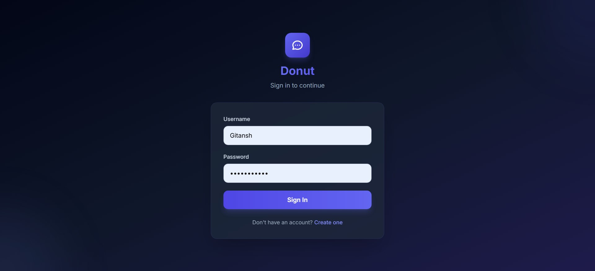
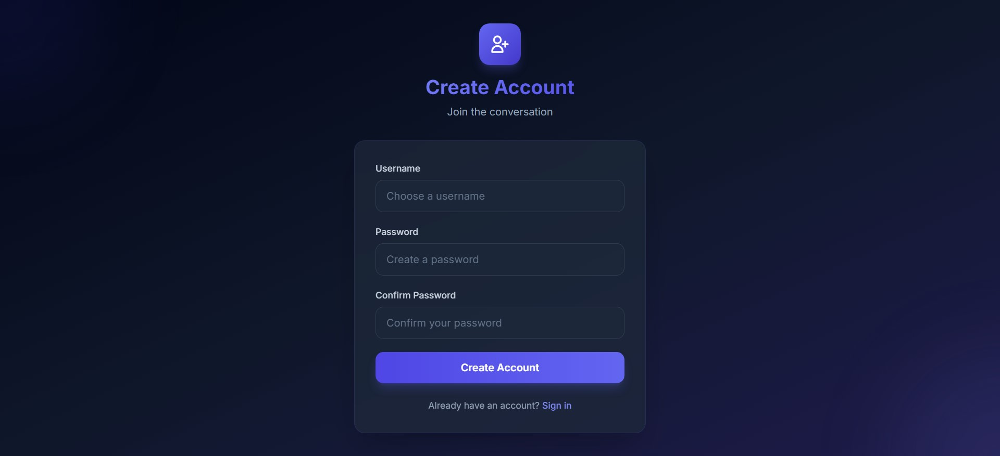
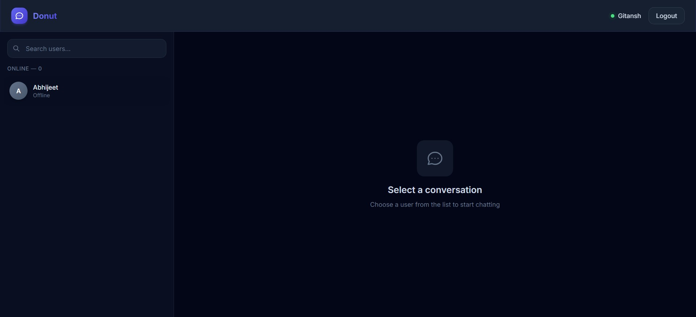
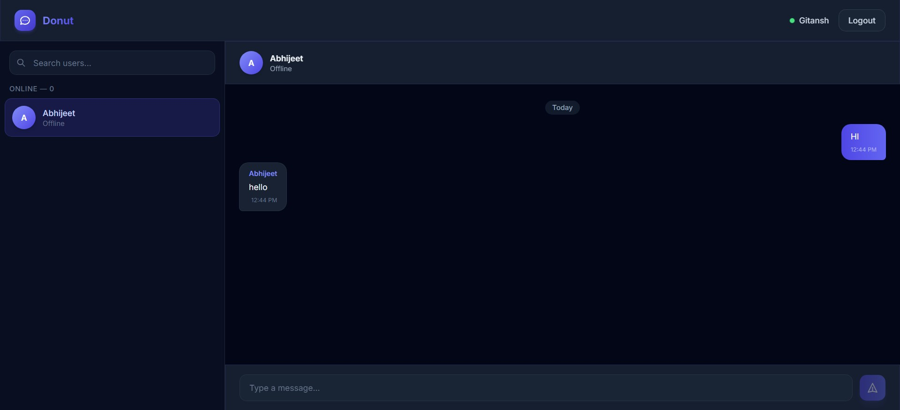

# 🍩 DONUT — Real-Time Chat Application

A full-stack real-time one-to-one chat application built with **Spring Boot** and **React**. Features JWT authentication, WebSocket messaging via STOMP/SockJS, and online user tracking — all wrapped in a sleek dark-themed UI.

---

## 📸 Screenshots

### Login Page
> Sign in with your credentials to access the chat.



### Registration Page
> Create a new account to get started.



### Chat Dashboard
> View all users and select someone to start a conversation.



### Real-Time Messaging
> Send and receive messages instantly with WebSocket-powered delivery.



---

## ✨ Features

- 🔐 **JWT Authentication** — Secure token-based login & registration
- 💬 **Real-Time Messaging** — Instant message delivery via WebSockets (STOMP + SockJS)
- 🟢 **Online Status Tracking** — See who's online in real-time
- 🔒 **Encrypted Passwords** — BCrypt hashing for all stored passwords
- 📜 **Chat History** — Loads last 20 messages per conversation
- 🌙 **Modern Dark UI** — Glassmorphism design with smooth animations

---

## 🛠️ Tech Stack

### Backend
| Technology | Purpose |
|-----------|---------|
| Spring Boot 3.4.4 | REST API + WebSocket server |
| Spring Security | Authentication & authorization |
| Spring Data JPA | Database operations |
| MySQL 8.x | Relational database |
| JJWT 0.12.6 | JWT token generation & validation |
| STOMP + SockJS | WebSocket protocol |

### Frontend
| Technology | Purpose |
|-----------|---------|
| React 18 | UI framework |
| Vite 6 | Build tool & dev server |
| Tailwind CSS 3 | Styling |
| Axios | HTTP client |
| @stomp/stompjs | WebSocket client |
| React Router v6 | Client-side routing |

---

## 📁 Project Structure

```
DONUT---Chatting-App/
├── backend/
│   ├── pom.xml
│   └── src/main/
│       ├── java/com/chatapp/
│       │   ├── ChatAppApplication.java
│       │   ├── config/
│       │   │   ├── SecurityConfig.java
│       │   │   └── WebSocketConfig.java
│       │   ├── controller/
│       │   │   ├── AuthController.java
│       │   │   ├── UserController.java
│       │   │   └── MessageController.java
│       │   ├── service/
│       │   │   ├── AuthService.java
│       │   │   ├── UserService.java
│       │   │   └── MessageService.java
│       │   ├── repository/
│       │   │   ├── UserRepository.java
│       │   │   └── MessageRepository.java
│       │   ├── model/
│       │   │   ├── User.java
│       │   │   └── Message.java
│       │   ├── security/
│       │   │   ├── JwtUtil.java
│       │   │   └── JwtFilter.java
│       │   └── websocket/
│       │       ├── WebSocketController.java
│       │       └── WebSocketEventListener.java
│       └── resources/
│           └── application.properties
│
├── frontend/
│   ├── package.json
│   ├── vite.config.js
│   ├── tailwind.config.js
│   ├── index.html
│   └── src/
│       ├── main.jsx
│       ├── App.jsx
│       ├── api/
│       │   └── axios.js
│       ├── context/
│       │   └── AuthContext.jsx
│       ├── pages/
│       │   ├── Login.jsx
│       │   ├── Register.jsx
│       │   └── Chat.jsx
│       ├── components/
│       │   ├── UserList.jsx
│       │   ├── ChatBox.jsx
│       │   └── MessageInput.jsx
│       ├── websocket/
│       │   └── socket.js
│       └── styles/
│           └── index.css
│
├── screenshots/
├── .gitignore
└── README.md
```

---

## 🚀 Getting Started

### Prerequisites

- **JDK 21** or higher
- **MySQL 8.x** running on `localhost:3306`
- **Node.js 18+** and npm
- **Maven**

### 1. Clone the Repository

```bash
git clone https://github.com/Gitanshg7/DONUT---Chatting-App.git
cd DONUT---Chatting-App
```

### 2. Database Setup

```sql
CREATE DATABASE chatapp;
```

### 3. Backend Setup

```bash
cd backend
```

Update `src/main/resources/application.properties` with your MySQL credentials:

```properties
spring.datasource.url=jdbc:mysql://localhost:3306/chatapp
spring.datasource.username=YOUR_USERNAME
spring.datasource.password=YOUR_PASSWORD
```

Run the Spring Boot server:

```bash
mvn spring-boot:run
```

> The server starts at `http://localhost:8080`. Hibernate auto-creates the `users` and `messages` tables.

### 4. Frontend Setup

```bash
cd frontend
npm install
npm run dev
```

> The Vite dev server starts at `http://localhost:5173`.

### 5. Start Chatting

1. Open `http://localhost:5173`
2. Register a new account
3. Open another browser/incognito window and register a second account
4. Select the other user from the sidebar and start chatting in real-time!

---

## 📡 API Endpoints

| Method | Endpoint | Auth | Description |
|--------|----------|------|-------------|
| `POST` | `/auth/register` | ❌ Public | Register a new user |
| `POST` | `/auth/login` | ❌ Public | Login and receive JWT |
| `GET` | `/users` | ✅ JWT | List all users except current |
| `POST` | `/messages/send` | ✅ JWT | Send a message |
| `GET` | `/messages/{username}` | ✅ JWT | Get chat history (last 20) |
| `WS` | `/ws` | ✅ JWT (STOMP) | WebSocket endpoint |

### WebSocket Topics

| Topic | Direction | Description |
|-------|-----------|-------------|
| `/topic/messages/{username}` | Server → Client | Receive real-time messages |
| `/topic/online-users` | Server → Client | Online users list broadcast |

---

## 🗄️ Database Schema

### `users` table

| Column | Type | Constraints |
|--------|------|-------------|
| `id` | BIGINT | PK, AUTO_INCREMENT |
| `username` | VARCHAR(255) | UNIQUE, NOT NULL |
| `password` | VARCHAR(255) | NOT NULL (BCrypt hash) |

### `messages` table

| Column | Type | Constraints |
|--------|------|-------------|
| `id` | BIGINT | PK, AUTO_INCREMENT |
| `sender` | VARCHAR(255) | NOT NULL |
| `receiver` | VARCHAR(255) | NOT NULL |
| `content` | TEXT | NOT NULL |
| `timestamp` | DATETIME(6) | NOT NULL |

---

## 🔐 Security

- **Passwords** are hashed with BCrypt before storage
- **JWT tokens** are signed with HMAC-SHA and contain username + expiration
- **Every API request** (except `/auth/**`) requires a valid `Authorization: Bearer <token>` header
- **WebSocket connections** validate JWT during the STOMP CONNECT handshake
- **Stateless sessions** — no server-side session storage
- **CORS** configured for frontend origin only

---

## 🧑‍💻 Author

**Gitansh** — [GitHub](https://github.com/Gitanshg7)

---

## 📄 License

This project is for educational purposes.
